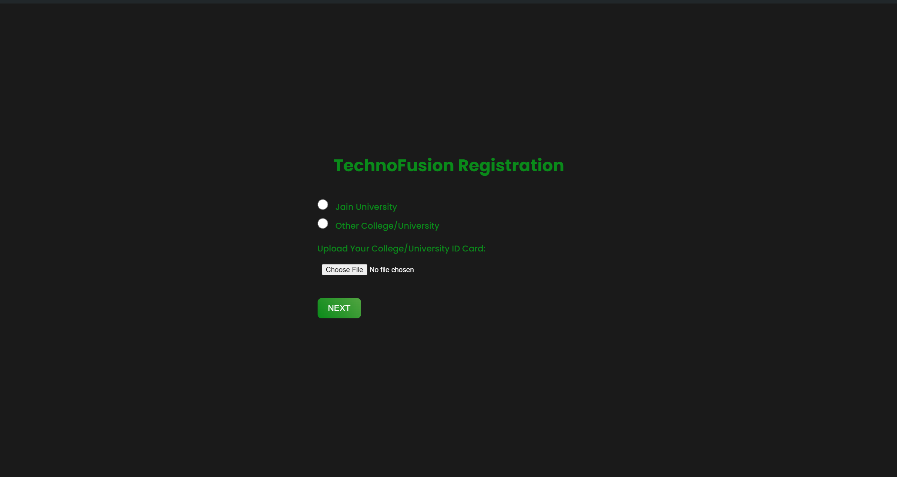

# TechnoFusion 2k24 - Official Registration Page

Welcome to the official registration page for **TechnoFusion 2k24**, an intercollegiate fest organized by the ACM Student Chapter of **JAIN (Deemed-to-be University)**. This page is designed to facilitate smooth and efficient participant registrations for the event, which took place on **29th and 30th August 2024**.



## About the Project

This project was developed to manage participant registrations for TechnoFusion 2k24. The front-end design and JavaScript functionalities were created by **Me - Garv Kamra**, and the backend, including server-side logic and database integration, was handled by **[Pratyush Kashyap](https://github.com/pratyushkashyyy)**.

### Event Details

- **Event Name**: TechnoFusion 2k24
- **Event Dates**: 29th and 30th August 2024
- **Organized by**: ACM Student Chapter, JAIN (Deemed-to-be University)
- **Type**: Intercollegiate Tech Fest

## Features

- **Dynamic Registration Form**: Includes form validation based on the participant's type (e.g., "JAIN" vs. "Other"), ensuring that necessary fields are filled out correctly.
- **Countdown Timer**: A responsive countdown that redirects users after a timer expires, used when participants click the WhatsApp group link.
- **WhatsApp Group Integration**: Opens the WhatsApp group link in a new tab, initiating a countdown for redirecting the current tab to the official event page.

## Project Structure

```plaintext
📂 TechnoFusion-registration-form
├── 📂 instance              # Configuration files
├── 📂 node_modules          # Node.js dependencies
├── 📂 static                # Contains static files (CSS, JavaScript, Images)
│   ├── 📂 styles
│   │   ├── index.css        # Main CSS for the registration page
│   │   ├── success.css       # CSS for success page
│   │   └── event-logo.png    # Your event logo or image
├── 📂 templates             # HTML templates for rendering
├── 📂 uploads               # Directory for uploaded files
├── 📄 main.py              # Main server file for handling requests
├── 📄 package-lock.json     # Node.js package lock file
├── 📄 package.json          # Node.js project file
└── 📄 README.md             # Project documentation
